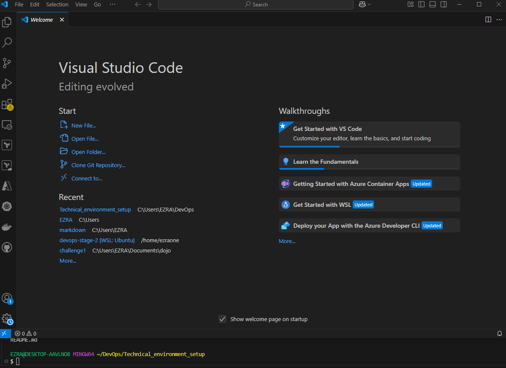
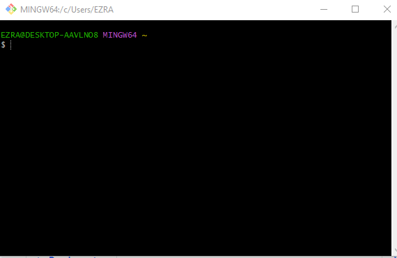
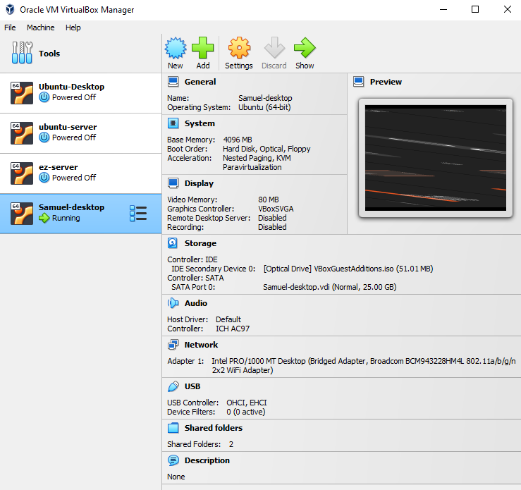
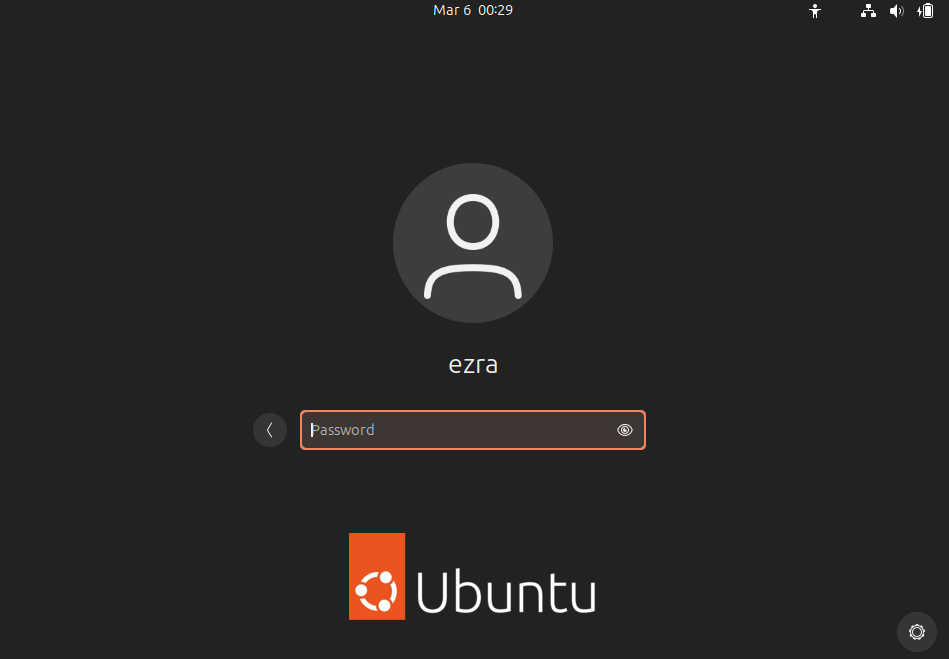
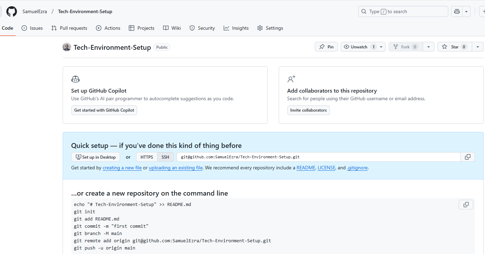

# Technical Environment Setup

## DevOps (Mini-Project) I

---

### Table of Contents

1. [Introduction](#introduction)
2. [Visual Studio Code](#visual-studio-code)
3. [Git](#git)
4. [Virtual Box](#virtual-box)
5. [Ubuntu](#ubuntu)
6. [GitHub Account](#github-account)
7. [Amazon Web Services (AWS)](#amazon-web-services-aws)
8. [Reference Links](#reference-links)

---

## Introduction

The objective of this mini-project is to provide a step-by-step guide on setting up the appropriate environment and installation of the required applications needed to practice DevOps.

While this document provides a list of key DevOps tools, it is not exhaustive. As one progresses in this dynamic field, more tools become available.

Follow this comprehensive guide to install the tools you need as you begin your DevOps journey.

---

## Visual Studio Code

Visual Studio Code is a versatile code editor that makes working with and modifying code and application files easy. To download and install, visit [Visual Studio Code](https://code.visualstudio.com/).

### Installation Steps (Windows)
- Double-click the downloaded `.exe` file to launch the installer.
- Accept the license agreement and click **Next**.
- Select additional options (e.g., creating a desktop shortcut) and click **Next**.
- Click **Install** and wait for the process to complete.
- Once installed, click **Finish** to launch VS Code.

### Installation Steps (Linux)
Run the following command to install:
```bash
sudo apt install ./<file-name>.deb
```
Replace `<file-name>` with the actual name of the downloaded file.
For `.rpm` files, navigate to the directory where the file was downloaded and execute:

```bash
sudo rpm -i <file-name>.rpm
```



---

## Git

Git Bash provides the ability to run Linux commands and handle version control directly from the terminal. Download Git Bash from [Git](https://git-scm.com/downloads).

#### Installation Steps (Windows)
- Locate the downloaded `.exe` file and double-click to launch the installer.
- Follow the installation wizard
- Click **Install** to begin the installation process.
- Once complete, click **Finish**.

#### Installation Steps (Linux)
Run the following commands:
```bash
sudo apt update
sudo apt install git
```




#### Verify Git Installation

Execute the following command in the terminal:
```bash
git --version
```
---

## Virtual Box

Virtual Box allows you to run multiple operating systems and servers on a single physical machine, making it essential for server-host interactions. Download Virtual Box from [VirtualBox](https://www.virtualbox.org/).

#### Installation Steps (Windows)

- Double-click the downloaded `.exe` file to start the installation
- Follow the installation wizard instructions.
- Click **Install** and wait for the process to complete.
- Click **Finish** once the installation is done.

#### Installation Steps (Linux)
For Debian-based systems, use the following command:

```bash
sudo apt install ./<file-name>.deb
```



---

## Ubuntu

Ubuntu is a popular open-source operating system, widely used for DevOps practices. Download it from [Ubuntu](https://ubuntu.com/download/desktop).


#### How to Install Ubuntu on Virtual Box

Create a New Virtual Machine
1. Click **New** in VirtualBox.
2. Enter a name for your virtual machine (e.g., "Ubuntu").
3. Set the Type to Linux and the Version to Ubuntu (64-bit).
4. Allocate memory (RAM)—minimum of 2GB (2048MB) is recommended.
5. Create a virtual hard disk:
    
    - Select **Create a virtual hard disk now**.
    - Choose **VDI (VirtualBox Disk Image)**.
    - Select **Dynamically allocated** storage.
    - Set the disk size (e.g., 20GB or more) and click **Create**.

Configure the Virtual Machine
1. Select your newly created virtual machine and click **Settings**.
2. Go to the **Storage** section: 

    - Under **Controller: IDE**, click the empty disk icon. 
    - Click the disk icon on the right and select **Choose a disk file**.
    - Browse to the Ubuntu ISO file and select it.

3. Save your changes and close the settings.

Start the Virtual Machine
1. Select your virtual machine and click **Start**.
2. The Ubuntu installer will load from the ISO file.

Install Ubuntu: 

Follow these steps:
1. Select your language and click **Install Ubuntu**.
2. Choose your keyboard layout.
3. Configure installation options (normal installation, updates, third-party software).
4. Choose **Erase disk and install Ubuntu**.
5. Set up your user account by providing your name, username, and password.
6. Confirm settings and click **Install Now**.
7. Once installation is complete, restart the virtual machine.

Post Installation

Run the following command:

```bash
sudo apt update && sudo apt upgrade
```




---

## Github

GitHub is a version control platform that enables developers to store, manage, and share their code. Create a GitHub account by visiting [Github](https://github.com/).


#### Steps to Create a Github Account:
1. Click **Sign up**
2. Enter your email address.
3. Choose a username (your GitHub identity).
4. Create a strong password.
5. Check your email for a verification code sent by GitHub.
6. Enter the code on the GitHub website to verify your email address.


Verify Installation

```bash
git --version
```



---

## Amazon Web Services (AWS)

AWS is a leading cloud platform that allows you to provision infrastructure and services for your applications. Create a free AWS account using [AWS](https://aws.amazon.com/free/).


#### Steps to Create an AWS Account
1. **Enter Account Information**

    - Provide your email address and choose a password.
    - Enter an AWS account name (e.g., your name or organization name).
    - Click **Continue**.

2. **Add Contact Information**

    - Choose account type (Personal or Business).
    - Fill in your contact details.
    - Agree to the AWS Customer Agreement and click **Continue**.

3. **Add Payment Information**
    - Provide credit or debit card details.
    - Click **Verify** and Add.

4. **Verify Your Identity**
    - Enter your phone number and choose a verification method (call or text).
    - Enter the received verification code.

5. **Choose a Support Plan**
    - Select a support plan (Basic Plan is free and sufficient for most users).
    - Click **Continue**.

6. Complete the Setup
    - Check for a confirmation email
    - Log in to the AWS Management Console using your credentials.

**Verify Installation**

Run:

```bash
aws --version
```


---

## Refence Links

- [Visual Studio Code](https://code.visualstudio.com/)
- [Git](https://git-scm.com/downloads)
- [VirtualBox](https://www.virtualbox.org/)
- [Ubuntu](https://ubuntu.com/download/desktop)
- [Github](https://github.com/)
- [AWS](https://aws.amazon.com/free/)