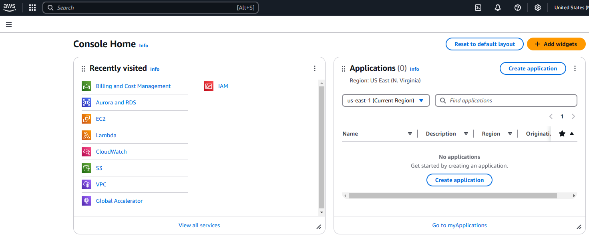

# Technical Environment Setup


> DevOps (Mini-Project) I

---


### Table of Contents

- [Introduction](#introduction)
- [Visual Sudio Code](#VScode)
- [Git](#Git)
- [Virtual Box](#Virtual_Box)
- [Ubuntu](#Ubuntu)
- [Github Account](#Github)
- [Amazon Web Services (AWS)](#AWS)
- [Reference Links](#Refence-Links)

---

## Introduction

The objective of this mini-project is to provide a step-by-step guide on guide on settiong up the right environment and installation of the required Applications needed to practice DevOps. 

While this document provides a list of key DevOps tools, it is not exhaustive. As one progresses in this Dynamic field, more and more tools becme available.

Follow the comprehensive guide in this document to install tools you would need as you begin your DevOps journey.

---

## Visual Sudio Code

This versatile code editor would make working with and modifying codes and application files easy. To download and install, visit [VScode](https://code.visualstudio.com/).

#### Installation Steps (Windows)
- Double-click the downloaded .exe file to launch the installer.
- Accept the license agreement and click Next.
- Select additional options (like creating a desktop shortcut) and click Next.
- Click Install and wait for the process to complete.
- Once installed, click Finish to launch VS Code.

#### For Linux
Run the following command to install:
```sh
sudo apt install ./<file-name>.deb
```
Replace *file-name* with the actual name of the downloaded file.

Open a terminal and navigate to the directory where the .rpm file was downloaded.

Run the following command to install:
```sh
sudo rpm -i <file-name>.rpm
```
Replace *file-name* with the actual name of the downloaded file.


---

## Git

With the Git bash terminal, you can run Linux commands and handle your version control from the command-line terminal. Download Git Bash from the site [Git](https://git-scm.com/downloads).

#### Installation Steps (Windows)
- Run the Installer
- Locate the downloaded .exe file and double-click to launch the installer.
- Follow the installation wizard
- Click Install to begin the installation process.
- Once complete, click Finish.

#### For Linux
```sh
sudo apt update
sudo apt install git
```


#### Verify Git Installation

On Terminal, Enter the following command:
```sh
git --version
```
---

## Virtual Box

With Virtual Box, you can run multiple operating systems and servers on the same physical machine. This comes in handy when you want to connect to a server from a host. Click [Virtual Box](https://www.virtualbox.org/) to download and install Virtual Box.

#### How to Install Virtual Box

- Locate the downloaded .exe file and double-click it to start the installation.
- Follow the installation wizard.
- Click Install and wait for the process to complete.
- Once installed, click Finish

#### For Linux
Open a terminal and navigate to the directory where the installer was downloaded.

For Debian-based systems (e.g., Ubuntu), install the .deb package:
```sh
sudo apt install ./<file-name>.deb
```


---

## Ubuntu

Ubuntu is an open-source operating system that powers increasingly more systems worldwide. It is one of the most popular Linux distributions available today. Download Ubuntu using the link [Ubuntu](https://ubuntu.com/download/desktop).


#### How to Install Ubuntu on Virtual Box

> Create a New Virtual Machine:
- Click the New button in VirtualBox.
- Enter a name for your virtual machine (e.g., "Ubuntu").
- Set the Type to Linux and the Version to Ubuntu (64-bit).
- Allocate memory (RAM) for the virtual machine. A minimum of 2GB (2048MB) is recommended, but 4GB or more is ideal.
- Create a virtual hard disk:
Select Create a virtual hard disk now; Choose VDI (VirtualBox Disk Image) as the file type; select Dynamically allocated for storage; set the disk size (e.g., 20GB or more) and click Create.

> Configure the Virtual Machine
- Select your newly created virtual machine and click Settings.
- Go to the `Storage` section: Under `Controller: IDE`, click the empty disk icon; click the disk icon on the right and select Choose a disk file; browse to the Ubuntu ISO file you downloaded and select it.
- Save your changes and close the settings.

> Start the Virtual Machine
- Select your virtual machine and click Start.
- The Ubuntu installer will load from the ISO file.

> Install Ubuntu: Follow the on-screen instructions:
- Select your language and click Install Ubuntu.
- Choose your keyboard layout.
- Select installation options (e.g., normal installation, updates, and third-party software).
- Choose Erase disk and install Ubuntu (this only affects the virtual disk, not your actual computer).
- Set up your user account by entering your name, username, and password.
- Click Install Now and confirm your choices.
- Wait for the installation to complete, then restart the virtual machine.

> Post Installation
```sh
sudo apt update && sudo apt upgrade
```


---

## Github

Github is a version control platform that allows developers and DevOps engineers alike to create, store, manage, and share their code. Create a Github account via the link [Github](https://github.com/).


#### Steps to Create a Github Account:
- From the link, Click `Sign up`
- Enter your email address.
- Choose a username (this will be your GitHub identity).
- Create a strong password.
- Check your email for a verification code sent by GitHub.
- Enter the code on the GitHub website to verify your email address.


> Verify Installation
```sh
git --version
```


---

## Amazon Web Services

Amazon Web Services or AWS is one of the major cloud providers in the world. AWS allows you to provision infrastructure and other services for your App to run. It offers flexibility, scalability, availability, etc. You can create a free AWS account via the link [AWS](https://aws.amazon.com/free/).


#### Steps to Create an Account in AWS
> Enter Account Information
- Provide your email address and choose a password.
- Enter an AWS account name (this can be your name or your organization's name).
- Click *Continue*.

> Add Contact Information
- Choose the account type: Personal or Business.
- Fill in your contact details, including your name, phone number, and address.
- Accept the AWS Customer Agreement and click *Continue*.

> Add Payment Information
- Enter your **credit card** or **debit card** details.
- Click ***Verify*** and Add.

> Verify Your Identity
- Enter your phone number and choose your preferred verification method (call or text).
- Enter the verification code sent to your phone.

> Choose a Support Plan
- Select a support plan. The Basic Plan is free and sufficient for most users.
- Click *Continue*.

> Complete the Setup
- Once your account is created, you’ll receive a confirmation email.
- Log in to the AWS Management Console using your email and password.

> Verify Installation
```sh
aws --version
```





---

## Refence Links

- https://code.visualstudio.com/
- https://git-scm.com/downloads
- https://www.virtualbox.org/
- https://github.com/
- https://ubuntu.com/download/desktop
- https://aws.amazon.com/free/